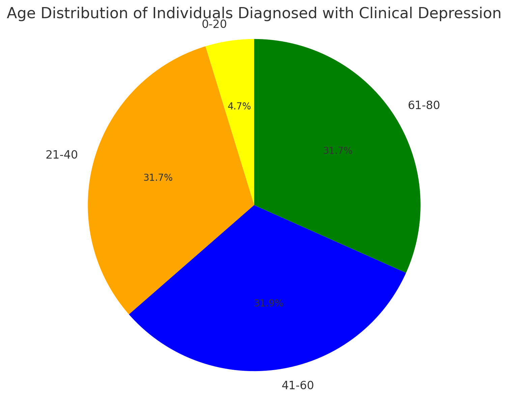
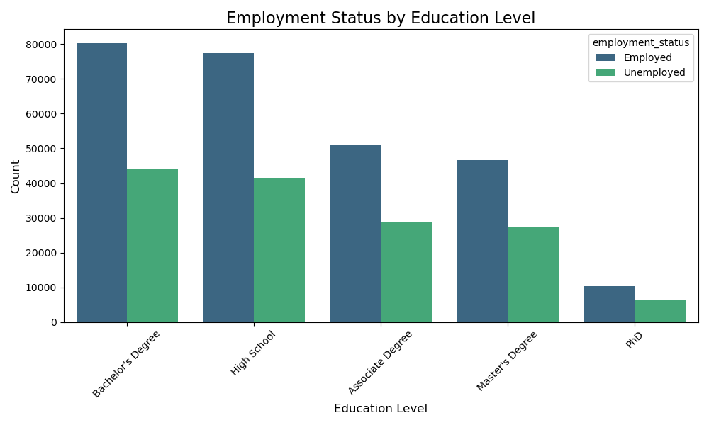
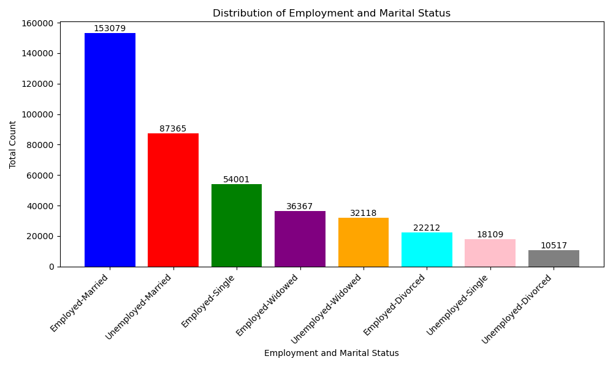

# Introduction

In this project, I am exploring a synthetic dataset that contains a range of personal, health, lifestyle, and socio-economic factors from individuals, all of whom have been diagnosed with clinical depression. The goal is to provide a data-driven analysis of how these factors may influence or correlate with clinical depression, providing valuable insights into the complex relationships between mental health, lifestyle choices, and socio-economic conditions.

I use frequent SQL queries with GROUP BY and COUNT to generate cross-tabulations of key factors such as lifestyle, socio-economic status, and health conditions. These tabulations are then visualized in charts or tables to analyze trends and patterns, providing a clearer understanding of how various factors relate to clinical depression.

Feel free to check out the queries for this analysis here : [project_queries](/project_queries/)


# Dataset

A dataset that contains information on individuals, diagnosed with clinical depression, with various attributes related to their personal and lifestyle factors from [kaggle](https://www.kaggle.com/datasets/anthonytherrien/depression-dataset?resource=download).


# My Tools for the Project

- **PostgreSQL :** The powerhouse database that combines reliability with cutting-edge features.
- **VS Code :** Your ultimate code editor for seamless coding and debugging adventures.
- **SQL :** The language that brings your data to life with precision and power.
- **Git :** The version control wizard that keeps your code history tidy and collaborative.
- **GitHub :** Essential for sharing my SQL scripts and analysis, ensuring collaboration and project tracking.
- **ChatGPT :** A powerful tool for data visualization that helps me generate visual charts after providing the results of my queries.

# Analysis

## 1. Demographic Factors

With the following queries i try to find if there is an impact of demographic factors on clinical depression.

**Age Distribution**

```sql
SELECT
    age_bucket,
    COUNT(*) AS total_count,
    ROUND((COUNT(*) / SUM(COUNT(*)) OVER ()) * 100, 2) AS percentage
FROM (
    SELECT
        CASE
            WHEN age BETWEEN 0 AND 20 THEN '0-20'
            WHEN age BETWEEN 21 AND 40 THEN '21-40'
            WHEN age BETWEEN 41 AND 60 THEN '41-60'
            WHEN age BETWEEN 61 AND 80 THEN '61-80'
            ELSE 'Unknown'
        END AS age_bucket
    FROM
        depression_data
) AS age_buckets
GROUP BY
    age_bucket;
```
The results

*Pie chart of age distribution for individuals diagnosed with clinical depression. This visualization was created with ChatGPT after importing my SQL query results*

It appears that the largest proportion of individuals with depression falls into the 21-80 age range, with the 41-60 and 61-80 age groups being the most prominent,
each accounting for roughly 31% of the total.This distribution suggests that adulthood, particularly the middle stages, is where depression is most commonly identified.

**Family Structure Impact on Depression.**

```sql
SELECT
    marital_status,
    COUNT(*) as count
FROM
    depression_data
GROUP BY
    marital_status
ORDER BY
    count DESC
```
The results
| Marital Status |  Count   |
|----------      |----------|
| Married        | 240444   |
| Single         | 72110    |
| Windowed       | 68485    |
| Divorced       | 32729    |

The highest number of individuals diagnosed with depression are married. This could suggest that marital stress or other related factors might contribute to depression in this group.
Widowed individuals and single individuals also show significant numbers. The loss of a spouse or the lack of a partner might be contributing factors to depression in these groups.
The number of divorced individuals diagnosed with depression is the lowest among the groups listed. This might indicate that while divorce is a stressful life event,
it may not be as strongly associated with depression as other marital statuses.

```sql
SELECT
    number_of_children,
    COUNT(*) as count
FROM
    depression_data
GROUP BY
    number_of_children
ORDER BY 
    count DESC
```
The results
| Number of children |  Count   |
|--------------------|----------|
| 0                  | 155232   |
| 1                  | 83961    |
| 2                  | 83925    |
| 3                  | 76974    |
| 4                  | 13676    |

Childlessness and Depression: There seems to be a higher incidence of depression among individuals without children. This could be due to various factors, including social isolation or lack of familial support.
Parental Support: Having children appears to have a complex relationship with depression. While parenting can be challenging, the presence of children might also provide emotional benefits that help mitigate depression.
Family Size and Support Systems: Larger families might offer stronger support systems, potentially leading to lower rates of depression among individuals with more children.

**How Employment and Education Levels are associated with depression.**

```sql
SELECT
    employment_status,
    COUNT(*) as count
FROM
    depression_data
GROUP BY
    employment_status
ORDER BY
    count DESC
```
The results
| Employment Status |  Count   |
|-------------------|----------|
| Employed          | 265659   |
| Unemployed        | 148109   |


Higher Depression Among the Employed: A larger number of employed individuals suffer from depression, which may indicate workplace-related stress or lack of adequate mental health support in work environments.
Impact of Unemployment on Mental Health: A substantial number of unemployed individuals also face depression, highlighting the mental health challenges related to financial instability and social isolation.

```sql
SELECT
    education_level,
    COUNT(*) as count
FROM
    depression_data
GROUP BY
    education_level
ORDER BY
    count DESC
```
The results
|    Education Level    |  Count   |
|-----------------------|----------|
| Bachelor's Degree     | 124329   |
| High School           | 118927   |
| Associate Degree      | 79999    |
| Master's Degree       | 73768    |
| PhD                   | 16745    |

Higher Depression Among Bachelor's Degree Holders: Individuals with a Bachelor's degree show the highest number of depression cases, which could reflect stress from job expectations, career transitions, or balancing professional and personal life.
Depression is Significant Across Education Levels: While there are higher numbers in Bachelor's and High School education levels, depression affects individuals at every stage of education, from high school to PhD holders.

**Intersection of Employment and Education Level.**

```sql
SELECT
    education_level,
    employment_status,
    COUNT(*) AS count
FROM
    depression_data
GROUP BY
    education_level, employment_status
ORDER BY
    count DESC;
```
The results

*Visual chart of employment status and education level of individuals diagnosed with clinical depression. This visualization was created with ChatGPT after importing my SQL query results*


The data suggests that both higher education and employment do not necessarily protect against depression. In fact, individuals with higher education levels still show high counts of depression diagnoses, indicating that other factors might be at play. Additionally high school graduates are often in a transitional phase, either entering the workforce or pursuing higher education. This period can be stressful and uncertain, contributing to mental health challenges.

**Intersection of Employment and Marital Status.**

```sql
SELECT
    employment_status,
    marital_status,
    COUNT(*) AS total
FROM
    depression_data
GROUP BY
    employment_status,
    marital_status
ORDER BY
    total DESC
```
The results

*Visual chart of employment status and education level of individuals diagnosed with clinical depression. This visualization was created with ChatGPT after importing my SQL query results*

Employment and marital status are key variables that may impact the prevalence or severity of depression. Married and employed individuals seem to dominate the dataset, but unemployment and certain life events (like widowhood or divorce) might exacerbate depression, especially when combined with the lack of employment.


## 2. Life Style Habits

Investigating the impact of Lifestyle Habits on Depression.

Purpose: To identify how lifestyle choices contribute to mental health outcomes.

**With this query i want to explore whether individuals with healthier diets are less likely to suffer from depression compared to those with moderate or unhealthy eating habits.**
```sql
SELECT
    dietary_habits,
    COUNT(*) as count
FROM
    depression_data
GROUP BY
    dietary_habits
ORDER BY
    count DESC
```
The results
| Dietary Habits |  Count   |
|----------------|----------|
| Unhealthy      | 170817   |
| Moderate       | 170446   |
| Healthy        | 72505    |

The data shows a trend where the majority of individuals diagnosed with depression have either unhealthy or moderate dietary habits, with a significantly smaller group following a healthy diet. This points to a potential link between poor diet and depression, which could be an important factor to explore in understanding the lifestyle elements associated with mental health.

**This query explores the correlation between different sleep patterns and the prevalence of clinical depression among individuals.**
```sql
SELECT
    sleep_patterns,
    COUNT(*) as count
FROM
    depression_data
GROUP BY
    sleep_patterns
ORDER BY
    count DESC
```
The results
| Sleep Patterns |  Count   |
|----------------|----------|
| Fair           | 196789   |
| Poor           | 129582   |
| Good           | 87397    |

The majority of individuals with depression report either fair or poor sleep patterns, with only a smaller portion enjoying good sleep. Sleep disturbances are a common and critical issue in individuals with depression, which can contribute to both the onset and severity of the condition. Improving sleep patterns might be a key area to explore for alleviating some symptoms of depression.

**With this query i aim to understand how different levels of physical activity are linked to clinical depression.**

```sql
SELECT
    physical_activity_level,
    COUNT(*) as count
FROM
    depression_data
GROUP BY
    physical_activity_level
ORDER BY
    count DESC
```
The results
| Physical Activity Level |  Count   |
|-------------------------|----------|
| Sedentary               | 176850   |
| Moderate                | 158013   |
| Active                  | 78905    |

The majority of individuals with depression tend to lead sedentary or moderately active lifestyles, with fewer reporting active lifestyles. This highlights a potential link between physical inactivity and depression, suggesting that increasing activity levels may be beneficial in managing depression symptoms. However, even individuals with moderate activity levels still experience depression, indicating that physical activity alone may not fully mitigate the condition.

**Is there a relationship between alcohol consumption levels (Low, Moderate, or High) and clinical depression?**

```sql
SELECT
    alcohol_consumption,
    COUNT(*) as count
FROM
    depression_data
GROUP BY
    alcohol_consumption
ORDER BY
    count DESC    
```
The results
| Alcohol Consumption |  Count   |
|---------------------|----------|
| Moderate            | 173440   |
| Low                 | 139250   |
| High                | 101078   |

**How smoking status interacts with clinical depression?**

```sql
SELECT
    smoking_status,
    COUNT(*) as count
FROM
    depression_data
GROUP BY
    smoking_status
ORDER BY
    count DESC 
```
The results
| Smoking Status |  Count   |
|---------------------|----------|
| Moderate            | 173440   |
| Low                 | 139250   |
| High                | 101078   |

The majority of individuals with depression, consume alcohol at moderate or low levels, with a smaller but significant portion reporting high alcohol intake. While moderate alcohol consumption might be common, it's important to note that even moderate drinking can have complex effects on mental health. High alcohol consumption among individuals with depression is a concern, as it can exacerbate symptoms and create additional health risks. This data suggests that alcohol use patterns are varied among those with depression, and managing alcohol intake may be an important factor in addressing their mental health.

## Correlations
With this query, I aim to identify the most frequent lifestyle patterns among individuals diagnosed with depression. By analyzing the top 20 combinations of smoking status, alcohol consumption, dietary habits, physical activity, and sleep patterns, I seek to gain insights into which lifestyle factors tend to cluster together in individuals with depression. This may help reveal the most common lifestyle risk factors or habits associated with depression in the dataset.
```sql
SELECT
    smoking_status,
    alcohol_consumption,
    dietary_habits,
    physical_activity_level,
    sleep_patterns,
    COUNT(*) AS depression_count
FROM
    depression_data
GROUP BY
    smoking_status,
    alcohol_consumption,
    dietary_habits,
    physical_activity_level,
    sleep_patterns
ORDER BY
    depression_count DESC
LIMIT 20
```
These are the results about the most frequent life habits observed in the top 20 most common combinations:

**Non smoker:** 18

**Former(smoker):** 2

**Moderate(alcohol consumption):** 11

**Low(alcohol consumption):** 6

**High(alcohol consumption):** 3

**Unhealthy(dietary habits):** 8

**Moderate(dietary habits):** 10

**Healthy(dietary habits):** 2

**Sedentary(physical activity):** 12

**Moderate(physical activity):** 8

**Fair(sleep patterns):** 14

**Poor(sleep patterns):** 5

**Good(sleep patterns):** 1

The most prominent patterns in this dataset for individuals with depression include:

- Sedentary lifestyles and unhealthy diets as common factors.
- Fair sleep patterns dominate, but poor sleep still plays a significant role.
- Moderate alcohol consumption appears frequently, while non-smokers are the most common smoking status.
- Overall, lifestyle factors such as lack of physical activity, poor dietary choices, and sleep disturbances appear to cluster together in individuals with depression.


## 3. Medical History and Current Medical Conditions

Investigating how medical history and chronic medical condition factors affect individuals diagnosed with clinical depression.


**History of mental illness.**

```sql
SELECT
    history_of_mental_illness,
    COUNT(*) as count
FROM
    depression_data
GROUP BY
    history_of_mental_illness
ORDER BY
    count DESC  
```
The results
| History of mental illness |  Count   |
|---------------------------|----------|
| FALSE                     | 287943   |
| TRUE                      | 125825   |

The data shows that the majority of individuals diagnosed with depression do not have a prior history of mental illness, though a significant portion does. This suggests that while depression can occur as a standalone condition, a notable subset of individuals may experience depression alongside or following other mental health issues.

**Chronic Medical Conditions.**

```sql
SELECT
    chronic_medical_conditions,
    COUNT(*) as count
FROM
    depression_data
GROUP BY
    chronic_medical_conditions
ORDER BY
    count DESC  
```
The results
| Chronic medical conditions |  Count   |
|----------------------------|----------|
| FALSE                      | 277561   |
| TRUE                       | 136207   |

The data shows that while the majority of individuals with depression do not have chronic medical conditions, a considerable portion does. This suggests that while depression can occur independently of chronic health problems, there is a notable intersection between depression and chronic physical health issues.

**Family History of Depression.**

```sql
SELECT
    family_history_of_depression,
    COUNT(*) as count
FROM
    depression_data
GROUP BY
    family_history_of_depression
ORDER BY
    count DESC  
```
The results
| Family history of depression |  Count   |
|------------------------------|----------|
| FALSE                        | 302515   |
| TRUE                         | 111253   |

The data shows that while most individuals with depression do not have a family history of the condition, a notable proportion do. This suggests that, for some, depression may be influenced by hereditary factors, making them more susceptible due to genetic predisposition. However, for the majority, depression seems to occur without a familial link, pointing to other causes or triggers beyond family history.
***

**Question :** Is there a pattern in how the life habits of individuals diagnosed with depression are affected by medical conditions, a history of mental illness, or a family history of depression?

With the following queries i will try to identify  the most common or strongest correlations of lifestyle behaviors linked to either case, among the individuals diagnosed with depression in the dataset.


**Chronic medical conditions
```sql
SELECT 
    Smoking_Status,
    Alcohol_Consumption,
    Physical_Activity_Level,
    Dietary_Habits,
    Sleep_Patterns,
    COUNT(CASE WHEN Chronic_Medical_Conditions = 'Yes' THEN 1 END) AS Chronic_Conditions_Count
FROM 
    depression_data
GROUP BY 
    Smoking_Status, 
    Alcohol_Consumption, 
    Physical_Activity_Level, 
    Dietary_Habits,
    Sleep_Patterns
ORDER BY
  COUNT(CASE WHEN Chronic_Medical_Conditions = 'Yes' THEN 1 END) DESC
limit 20
```
These are the results about the most frequent life habits observed in the top 20 most common combinations:

**Non smoker:** 19

**Former(smoker):** 1

**Moderate(alcohol consumption):** 10

**Low(alcohol consumption):** 7

**High(alcohol consumption):** 3

**Unhealthy(dietary habits):** 10

**Moderate(dietary habits):** 8

**Healthy(dietary habits):** 2

**Sedentary(physical activity):** 12

**Moderate(physical activity):** 8

**Fair(sleep patterns):** 13

**Poor(sleep patterns):** 7

**Good(sleep patterns):** 0

**History of mental illness

The most frequent lifestyle patterns among individuals with depression and chronic medical conditions include non-smoking, moderate alcohol consumption, unhealthy or moderate dietary habits, sedentary lifestyles, and fair or poor sleep quality. These factors suggest that inactivity, poor diet, and sleep disturbances are strongly correlated with both depression and chronic medical conditions, while smoking plays a smaller role in this specific group.

```sql
SELECT 
    Smoking_Status,
    Alcohol_Consumption,
    Physical_Activity_Level,
    Dietary_Habits,
    Sleep_Patterns,
    COUNT(CASE WHEN history_of_mental_illness = 'Yes' THEN 1 END) AS history_of_mental_illness_Count
FROM 
    depression_data
GROUP BY 
    Smoking_Status, 
    Alcohol_Consumption, 
    Physical_Activity_Level, 
    Dietary_Habits,
    Sleep_Patterns
ORDER BY
  COUNT(CASE WHEN history_of_mental_illness = 'Yes' THEN 1 END) DESC
limit 20
```
These are the results about the most frequent life habits observed in the top 20 most common combinations:

**Non smoker:** 19

**Former(smoker):** 1

**Moderate(alcohol consumption):** 9

**Low(alcohol consumption):** 7

**High(alcohol consumption):** 4

**Unhealthy(dietary habits):** 9

**Moderate(dietary habits):** 10

**Healthy(dietary habits):** 1

**Sedentary(physical activity):** 13

**Moderate(physical activity):** 7

**Fair(sleep patterns):** 12

**Poor(sleep patterns):** 8

**Good(sleep patterns):** 0

The most frequent lifestyle habits among individuals with depression and a history of mental illness include being a non-smoker, having moderate alcohol consumption, maintaining moderate or unhealthy dietary habits, leading a sedentary lifestyle, and experiencing fair or poor sleep patterns. These patterns highlight the importance of lifestyle factors such as physical inactivity, poor diet, and sleep disturbances in this group, which may exacerbate the effects of mental illness and depression.

**History of mental illness
**Family history of depression**

```sql
SELECT 
    Smoking_Status,
    Alcohol_Consumption,
    Physical_Activity_Level,
    Dietary_Habits,
    Sleep_Patterns,
    COUNT(CASE WHEN family_history_of_depression = 'Yes' THEN 1 END) AS family_history_of_depression_Count
FROM 
    depression_data
GROUP BY 
    Smoking_Status, 
    Alcohol_Consumption, 
    Physical_Activity_Level, 
    Dietary_Habits,
    Sleep_Patterns
ORDER BY
  COUNT(CASE WHEN family_history_of_depression = 'Yes' THEN 1 END) DESC
limit 20
```

These are the results about the most frequent life habits observed in the top 20 most common combinations:

**Non smoker:** 17

**Former(smoker):** 3

**Moderate(alcohol consumption):** 10

**Low(alcohol consumption):** 6

**High(alcohol consumption):** 4

**Unhealthy(dietary habits):** 11

**Moderate(dietary habits):** 7

**Healthy(dietary habits):** 2

**Sedentary(physical activity):** 14

**Moderate(physical activity):** 6

**Fair(sleep patterns):** 14

**Poor(sleep patterns):** 5

**Good(sleep patterns):** 1

The most frequent lifestyle habits among individuals with depression and a family history of depression include being non-smokers, having moderate alcohol consumption, maintaining unhealthy dietary habits, leading sedentary lifestyles, and experiencing fair sleep patterns. These patterns indicate that poor diet, physical inactivity, and sleep disturbances are common in individuals who have both depression and a genetic predisposition for the condition, emphasizing the importance of lifestyle factors in managing mental health.

# Conclusion


## Key Findings

**Demographic Factors:**

The majority of individuals with depression fall within the 41-60 and 61-80 age groups, suggesting that middle-aged and older adults are more affected. Married individuals have the highest prevalence of depression, possibly due to relationship stress, while single and widowed individuals also show significant numbers.
Individuals without children show higher depression rates, indicating a potential link between childlessness and depression, possibly due to social isolation.

**Employment and Education:**

Employed individuals have higher rates of depression, potentially due to workplace stress. However, unemployment also significantly contributes to depression, likely due to financial instability.
Individuals with a Bachelor’s degree show the highest rates of depression, suggesting that higher education does not protect against depression and may even exacerbate it due to career stress and expectations.

**Lifestyle Factors:**

Unhealthy diets, sedentary lifestyles, and poor or fair sleep patterns are strongly correlated with depression. These lifestyle factors seem to cluster together, contributing to the onset or exacerbation of depression.
While moderate alcohol consumption is the most common among individuals with depression, high alcohol intake still plays a significant role in worsening mental health.

**Medical History and Chronic Conditions:**

The data shows that the majority of individuals with depression do not have a prior history of mental illness, although a significant portion does, indicating that depression can develop both independently and alongside other mental health issues.
Chronic medical conditions are present in a considerable number of individuals with depression, showing a strong link between physical health and mental well-being.
A substantial proportion of individuals with depression also have a family history of depression, indicating a genetic predisposition in certain cases.

# Final thoughts

The analysis revealed that lifestyle habits, including diet, physical activity, and sleep quality, have a strong association with depression, especially when combined with chronic medical conditions or a family history of the condition. Additionally, demographic factors like age, marital status, and education level play a crucial role in depression prevalence. While employment does not necessarily protect against depression, factors such as stress, job expectations, and financial instability seem to contribute significantly.
Final Thoughts:

This project highlights the multi-faceted nature of depression, where personal, lifestyle, socio-economic, and genetic factors interact in complex ways. The findings suggest that addressing lifestyle habits such as physical activity, diet, and sleep quality, alongside proper management of chronic conditions and mental health histories, may help mitigate depression's impact. The data-driven insights can be valuable for mental health professionals and researchers in understanding the root causes and risk factors associated with depression.
